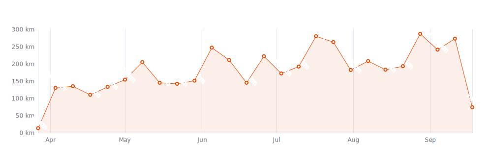

    

Since I began cycling `142 days` ago on `27-03-2023`,
I had `99 cycling days`. 
I recorded a total distance of `3 516 km`,
an elevation of `30 965 m`
and a total time of `5d 17h 38m` 🎉

That's a daily average of `25 km`,
a weekly average of `167 km` and a
monthly average of `703 km` 🐣

I burned `74433 calories` doing so, that's about `276` pizza slices 🍕

---

<kbd><a href="#weekly-distances">Weekly distances</a></kbd> |
<kbd><a href="#activities">Activities</a></kbd> |
<kbd><a href="#monthly-stats">Monthly stats</a></kbd> |
<kbd><a href="#stats-per-weekday">Stats per weekday</a></kbd> |
<kbd><a href="#stats-per-bike">Stats per bike</a></kbd> |
<kbd><a href="#best-power-outputs-over-time">Power outputs</a></kbd> |
<kbd><a href="#completed-challenges">Completed challenges</a></kbd>

## Weekly distances

## Activities

<table>
    <tr>
        <th></th>
        <th></th>
        <th align="center"></th>
        <th align="center"></th>
        <th align="center"></th>
        <th align="center"></th>
        <th align="center"></th>
        <th align="center"></th>
    </tr>
            <tr>
            <td>16-08-23</td>
            <td>
                
                <a href="https://www.strava.com/activities/9657780981" title="Kcal: 1269 | Gear: Retro Race Bike ">🇫🇷 Ride #2</a>
            </td>
            <td align="center">46 km</td>
            <td align="center">631 m</td>
            <td align="center">1:42:25</td>
            <td align="center">160 w</td>
            <td align="center">26.7 km/h</td>
            <td align="center">159</td>
        </tr>
            <tr>
            <td>15-08-23</td>
            <td>
                
                <a href="https://www.strava.com/activities/9653331316" title="Kcal: 823 | Gear: Retro Race Bike ">🇫🇷 Ride #1, avec la copine</a>
            </td>
            <td align="center">30 km</td>
            <td align="center">433 m</td>
            <td align="center">1:43:49</td>
            <td align="center">83 w</td>
            <td align="center">17.6 km/h</td>
            <td align="center">118</td>
        </tr>
            <tr>
            <td>13-08-23</td>
            <td>
                
                <a href="https://www.strava.com/activities/9637319898" title="Kcal: 1727 | Gear: Retro Race Bike ">🇮🇹 Ride #4, final one</a>
            </td>
            <td align="center">56 km</td>
            <td align="center">608 m</td>
            <td align="center">2:16:27</td>
            <td align="center">139 w</td>
            <td align="center">24.5 km/h</td>
            <td align="center">162</td>
        </tr>
            <tr>
            <td>12-08-23</td>
            <td>
                
                <a href="https://www.strava.com/activities/9634781812" title="Kcal: 228 | Gear: Retro Race Bike ">🇮🇹 Afternoon Ride</a>
            </td>
            <td align="center">8 km</td>
            <td align="center">48 m</td>
            <td align="center">27:09</td>
            <td align="center">71 w</td>
            <td align="center">17 km/h</td>
            <td align="center">123</td>
        </tr>
            <tr>
            <td>11-08-23</td>
            <td>
                
                <a href="https://www.strava.com/activities/9627264378" title="Kcal: 1351 | Gear: Retro Race Bike ">🇮🇹 Ride #3 avec la girlfriend</a>
            </td>
            <td align="center">52 km</td>
            <td align="center">334 m</td>
            <td align="center">3:00:32</td>
            <td align="center">65 w</td>
            <td align="center">17.3 km/h</td>
            <td align="center">116</td>
        </tr>
            <tr>
            <td>10-08-23</td>
            <td>
                
                <a href="https://www.strava.com/activities/9620486295" title="Kcal: 229 | Gear: Retro Race Bike ">🇮🇹 Lunch Ride</a>
            </td>
            <td align="center">8 km</td>
            <td align="center">127 m</td>
            <td align="center">30:49</td>
            <td align="center">83 w</td>
            <td align="center">15 km/h</td>
            <td align="center">114</td>
        </tr>
            <tr>
            <td>09-08-23</td>
            <td>
                
                <a href="https://www.strava.com/activities/9612009708" title="Kcal: 1374 | Gear: Retro Race Bike ">🇮🇹 Ride #2</a>
            </td>
            <td align="center">50 km</td>
            <td align="center">561 m</td>
            <td align="center">2:02:22</td>
            <td align="center">134 w</td>
            <td align="center">24.4 km/h</td>
            <td align="center">151</td>
        </tr>
            <tr>
            <td>08-08-23</td>
            <td>
                
                <a href="https://www.strava.com/activities/9606936487" title="Kcal: 1067 | Gear: Retro Race Bike ">Toerke met het vrouwtje 🇮🇹</a>
            </td>
            <td align="center">34 km</td>
            <td align="center">334 m</td>
            <td align="center">2:10:10</td>
            <td align="center">67 w</td>
            <td align="center">15.5 km/h</td>
            <td align="center">120</td>
        </tr>
            <tr>
            <td>05-08-23</td>
            <td>
                
                <a href="https://www.strava.com/activities/9586615456" title="Kcal: 998 | Gear: Zwift Hub ">Serrated in London</a>
            </td>
            <td align="center">52 km</td>
            <td align="center">132 m</td>
            <td align="center">1:30:18</td>
            <td align="center">193 w</td>
            <td align="center">34.8 km/h</td>
            <td align="center">157</td>
        </tr>
            <tr>
            <td>04-08-23</td>
            <td>
                
                <a href="https://www.strava.com/activities/9582002750" title="Kcal: 665 | Gear: Zwift Hub ">Malevolent in New York</a>
            </td>
            <td align="center">28 km</td>
            <td align="center">495 m</td>
            <td align="center">1:00:27</td>
            <td align="center">192 w</td>
            <td align="center">28.3 km/h</td>
            <td align="center">154</td>
        </tr>
            <tr>
            <td>02-08-23</td>
            <td>
                
                <a href="https://www.strava.com/activities/9569764172" title="Kcal: 621 | Gear: Zwift Hub ">Circus in New York</a>
            </td>
            <td align="center">28 km</td>
            <td align="center">444 m</td>
            <td align="center">1:00:06</td>
            <td align="center">180 w</td>
            <td align="center">28.1 km/h</td>
            <td align="center">157</td>
        </tr>
            <tr>
            <td>01-08-23</td>
            <td>
                
                <a href="https://www.strava.com/activities/9563517795" title="Kcal: 687 | Gear: Zwift Hub ">Race: EVO CC Race Series (...</a>
            </td>
            <td align="center">29 km</td>
            <td align="center">102 m</td>
            <td align="center">43:46</td>
            <td align="center">241 w</td>
            <td align="center">39.2 km/h</td>
            <td align="center">181</td>
        </tr>
            <tr>
            <td>31-07-23</td>
            <td>
                
                <a href="https://www.strava.com/activities/9556405540" title="Kcal: 811 | Gear: Zwift Hub ">Melange in Watopia</a>
            </td>
            <td align="center">45 km</td>
            <td align="center">542 m</td>
            <td align="center">1:30:45</td>
            <td align="center">156 w</td>
            <td align="center">29.5 km/h</td>
            <td align="center">145</td>
        </tr>
            <tr>
            <td>29-07-23</td>
            <td>
                
                <a href="https://www.strava.com/activities/9544303302" title="Kcal: 1185 | Gear: Zwift Hub ">Mosaic in Watopia</a>
            </td>
            <td align="center">50 km</td>
            <td align="center">955 m</td>
            <td align="center">1:55:13</td>
            <td align="center">180 w</td>
            <td align="center">26.2 km/h</td>
            <td align="center">154</td>
        </tr>
            <tr>
            <td>29-07-23</td>
            <td>
                
                <a href="https://www.strava.com/activities/9542782814" title="Kcal: 293 | Gear: Retro Race Bike ">Morning Ride</a>
            </td>
            <td align="center">12 km</td>
            <td align="center">15 m</td>
            <td align="center">31:56</td>
            <td align="center">92 w</td>
            <td align="center">23.3 km/h</td>
            <td align="center">129</td>
        </tr>
            <tr>
            <td>27-07-23</td>
            <td>
                
                <a href="https://www.strava.com/activities/9531982736" title="Kcal: 567 | Gear: Zwift Hub ">Hang Ten in London</a>
            </td>
            <td align="center">33 km</td>
            <td align="center">88 m</td>
            <td align="center">1:00:06</td>
            <td align="center">165 w</td>
            <td align="center">33 km/h</td>
            <td align="center">145</td>
        </tr>
            <tr>
            <td>26-07-23</td>
            <td>
                
                <a href="https://www.strava.com/activities/9527434111" title="Kcal: 1622 | Gear: Retro Race Bike ">Toertje van de vaart met d...</a>
            </td>
            <td align="center">73 km</td>
            <td align="center">50 m</td>
            <td align="center">2:30:46</td>
            <td align="center">n/a</td>
            <td align="center">29 km/h</td>
            <td align="center">142</td>
        </tr>
            <tr>
            <td>26-07-23</td>
            <td>
                
                <a href="https://www.strava.com/activities/9527451112" title="Kcal: 359 | Gear: Retro Race Bike ">Afternoon Ride</a>
            </td>
            <td align="center">9 km</td>
            <td align="center">8 m</td>
            <td align="center">23:40</td>
            <td align="center">n/a</td>
            <td align="center">23.7 km/h</td>
            <td align="center">146</td>
        </tr>
            <tr>
            <td>25-07-23</td>
            <td>
                
                <a href="https://www.strava.com/activities/9519797203" title="Kcal: 550 | Gear: Zwift Hub ">Race: EVO CC Race Series (...</a>
            </td>
            <td align="center">22 km</td>
            <td align="center">154 m</td>
            <td align="center">34:34</td>
            <td align="center">240 w</td>
            <td align="center">38.7 km/h</td>
            <td align="center">176</td>
        </tr>
            <tr>
            <td>24-07-23</td>
            <td>
                
                <a href="https://www.strava.com/activities/9513068209" title="Kcal: 1113 | Gear: Zwift Hub ">Bricolage in Watopia</a>
            </td>
            <td align="center">64 km</td>
            <td align="center">497 m</td>
            <td align="center">2:00:07</td>
            <td align="center">162 w</td>
            <td align="center">31.9 km/h</td>
            <td align="center">142</td>
        </tr>
            <tr>
            <td>23-07-23</td>
            <td>
                
                <a href="https://www.strava.com/activities/9507879874" title="Kcal: 262 | Gear: Retro Race Bike ">Morning Ride</a>
            </td>
            <td align="center">12 km</td>
            <td align="center">4 m</td>
            <td align="center">29:07</td>
            <td align="center">n/a</td>
            <td align="center">24.7 km/h</td>
            <td align="center">128</td>
        </tr>
            <tr>
            <td>22-07-23</td>
            <td>
                
                <a href="https://www.strava.com/activities/9499680193" title="Kcal: 545 | Gear: Zwift Hub ">Giza in France</a>
            </td>
            <td align="center">32 km</td>
            <td align="center">147 m</td>
            <td align="center">1:00:19</td>
            <td align="center">158 w</td>
            <td align="center">32.2 km/h</td>
            <td align="center">136</td>
        </tr>
            <tr>
            <td>21-07-23</td>
            <td>
                
                <a href="https://www.strava.com/activities/9494450902" title="Kcal: 2582 | Gear: Retro Race Bike ">First Gran Fondo evah 🥳</a>
            </td>
            <td align="center">102 km</td>
            <td align="center">93 m</td>
            <td align="center">3:40:28</td>
            <td align="center">n/a</td>
            <td align="center">27.7 km/h</td>
            <td align="center">151</td>
        </tr>
            <tr>
            <td>19-07-23</td>
            <td>
                
                <a href="https://www.strava.com/activities/9483741727" title="Kcal: 1769 | Gear: Retro Race Bike ">BikerBoys 🏍️</a>
            </td>
            <td align="center">69 km</td>
            <td align="center">149 m</td>
            <td align="center">2:36:49</td>
            <td align="center">n/a</td>
            <td align="center">26.5 km/h</td>
            <td align="center">149</td>
        </tr>
            <tr>
            <td>19-07-23</td>
            <td>
                
                <a href="https://www.strava.com/activities/9481993011" title="Kcal: 313 | Gear: Retro Race Bike ">Afternoon Ride</a>
            </td>
            <td align="center">13 km</td>
            <td align="center">32 m</td>
            <td align="center">32:16</td>
            <td align="center">n/a</td>
            <td align="center">24.8 km/h</td>
            <td align="center">135</td>
        </tr>
            <tr>
            <td>18-07-23</td>
            <td>
                
                <a href="https://www.strava.com/activities/9475869554" title="Kcal: 588 | Gear: Zwift Hub ">Spaded Sweetie in Richmond</a>
            </td>
            <td align="center">27 km</td>
            <td align="center">344 m</td>
            <td align="center">1:00:04</td>
            <td align="center">171 w</td>
            <td align="center">27.4 km/h</td>
            <td align="center">149</td>
        </tr>
            <tr>
            <td>17-07-23</td>
            <td>
                
                <a href="https://www.strava.com/activities/9468607450" title="Kcal: 585 | Gear: Zwift Hub ">LOX in Makuri Islands</a>
            </td>
            <td align="center">25 km</td>
            <td align="center">310 m</td>
            <td align="center">1:00:17</td>
            <td align="center">169 w</td>
            <td align="center">24.9 km/h</td>
            <td align="center">148</td>
        </tr>
            <tr>
            <td>14-07-23</td>
            <td>
                
                <a href="https://www.strava.com/activities/9450997559" title="Kcal: 919 | Gear: Zwift Hub ">Cucumber in New York</a>
            </td>
            <td align="center">41 km</td>
            <td align="center">695 m</td>
            <td align="center">1:30:07</td>
            <td align="center">178 w</td>
            <td align="center">27.6 km/h</td>
            <td align="center">155</td>
        </tr>
            <tr>
            <td>14-07-23</td>
            <td>
                
                <a href="https://www.strava.com/activities/9451148657" title="Kcal: 318 | Gear: Retro Race Bike ">Morning Ride</a>
            </td>
            <td align="center">13 km</td>
            <td align="center">31 m</td>
            <td align="center">35:55</td>
            <td align="center">n/a</td>
            <td align="center">22.2 km/h</td>
            <td align="center">129</td>
        </tr>
            <tr>
            <td>12-07-23</td>
            <td>
                
                <a href="https://www.strava.com/activities/9439311948" title="Kcal: 1649 | Gear: Retro Race Bike ">Avec le Bikerboys</a>
            </td>
            <td align="center">60 km</td>
            <td align="center">92 m</td>
            <td align="center">2:12:40</td>
            <td align="center">n/a</td>
            <td align="center">27.1 km/h</td>
            <td align="center">158</td>
        </tr>
            <tr>
            <td>11-07-23</td>
            <td>
                
                <a href="https://www.strava.com/activities/9431441829" title="Kcal: 896 | Gear: Zwift Hub ">Kirizuma in France</a>
            </td>
            <td align="center">47 km</td>
            <td align="center">310 m</td>
            <td align="center">1:30:15</td>
            <td align="center">173 w</td>
            <td align="center">31.1 km/h</td>
            <td align="center">161</td>
        </tr>
            <tr>
            <td>10-07-23</td>
            <td>
                
                <a href="https://www.strava.com/activities/9424963443" title="Kcal: 547 | Gear: Zwift Hub ">C.A. in Paris</a>
            </td>
            <td align="center">31 km</td>
            <td align="center">185 m</td>
            <td align="center">1:00:15</td>
            <td align="center">159 w</td>
            <td align="center">30.5 km/h</td>
            <td align="center">152</td>
        </tr>
            <tr>
            <td>09-07-23</td>
            <td>
                
                <a href="https://www.strava.com/activities/9417045637" title="Kcal: 543 | Gear: Zwift Hub ">Uphill Battle in Paris</a>
            </td>
            <td align="center">30 km</td>
            <td align="center">172 m</td>
            <td align="center">1:00:12</td>
            <td align="center">158 w</td>
            <td align="center">30.1 km/h</td>
            <td align="center">144</td>
        </tr>
            <tr>
            <td>08-07-23</td>
            <td>
                
                <a href="https://www.strava.com/activities/9417185349" title="Kcal: 285 | Gear: Retro Race Bike ">Afternoon Ride</a>
            </td>
            <td align="center">11 km</td>
            <td align="center">14 m</td>
            <td align="center">35:05</td>
            <td align="center">n/a</td>
            <td align="center">18.3 km/h</td>
            <td align="center">121</td>
        </tr>
            <tr>
            <td>08-07-23</td>
            <td>
                
                <a href="https://www.strava.com/activities/9412342812" title="Kcal: 276 | Gear: Retro Race Bike ">Morning Ride</a>
            </td>
            <td align="center">12 km</td>
            <td align="center">4 m</td>
            <td align="center">30:49</td>
            <td align="center">n/a</td>
            <td align="center">23.4 km/h</td>
            <td align="center">126</td>
        </tr>
            <tr>
            <td>07-07-23</td>
            <td>
                
                <a href="https://www.strava.com/activities/9412348049" title="Kcal: 155 | Gear: None ">Evening Ride</a>
            </td>
            <td align="center">4 km</td>
            <td align="center">7 m</td>
            <td align="center">12:56</td>
            <td align="center">n/a</td>
            <td align="center">17.9 km/h</td>
            <td align="center">117</td>
        </tr>
            <tr>
            <td>07-07-23</td>
            <td>
                
                <a href="https://www.strava.com/activities/9406488593" title="Kcal: 547 | Gear: Zwift Hub ">Attack! in Makuri Islands</a>
            </td>
            <td align="center">31 km</td>
            <td align="center">251 m</td>
            <td align="center">1:00:45</td>
            <td align="center">157 w</td>
            <td align="center">30.6 km/h</td>
            <td align="center">159</td>
        </tr>
            <tr>
            <td>07-07-23</td>
            <td>
                
                <a href="https://www.strava.com/activities/9406021001" title="Kcal: 327 | Gear: Retro Race Bike ">Afternoon Ride</a>
            </td>
            <td align="center">12 km</td>
            <td align="center">31 m</td>
            <td align="center">33:32</td>
            <td align="center">n/a</td>
            <td align="center">21.6 km/h</td>
            <td align="center">129</td>
        </tr>
            <tr>
            <td>05-07-23</td>
            <td>
                
                <a href="https://www.strava.com/activities/9394451254" title="Kcal: 566 | Gear: Zwift Hub ">15.9 in London</a>
            </td>
            <td align="center">29 km</td>
            <td align="center">260 m</td>
            <td align="center">1:00:13</td>
            <td align="center">164 w</td>
            <td align="center">28.5 km/h</td>
            <td align="center">162</td>
        </tr>
            <tr>
            <td>04-07-23</td>
            <td>
                
                <a href="https://www.strava.com/activities/9388733291" title="Kcal: 848 | Gear: Zwift Hub ">HWBTWTDWH in Scotland</a>
            </td>
            <td align="center">43 km</td>
            <td align="center">519 m</td>
            <td align="center">1:30:31</td>
            <td align="center">163 w</td>
            <td align="center">28.2 km/h</td>
            <td align="center">144</td>
        </tr>
            <tr>
            <td>02-07-23</td>
            <td>
                
                <a href="https://www.strava.com/activities/9372557932" title="Kcal: 523 | Gear: Zwift Hub ">Tine in New York</a>
            </td>
            <td align="center">25 km</td>
            <td align="center">401 m</td>
            <td align="center">1:00:51</td>
            <td align="center">150 w</td>
            <td align="center">24.8 km/h</td>
            <td align="center">143</td>
        </tr>
            <tr>
            <td>01-07-23</td>
            <td>
                
                <a href="https://www.strava.com/activities/9369192999" title="Kcal: 523 | Gear: Zwift Hub ">#8 in France</a>
            </td>
            <td align="center">27 km</td>
            <td align="center">262 m</td>
            <td align="center">1:01:59</td>
            <td align="center">147 w</td>
            <td align="center">25.8 km/h</td>
            <td align="center">142</td>
        </tr>
            <tr>
            <td>01-07-23</td>
            <td>
                
                <a href="https://www.strava.com/activities/9367494764" title="Kcal: n/a | Gear: None ">Morning Ride</a>
            </td>
            <td align="center">11 km</td>
            <td align="center">13 m</td>
            <td align="center">40:03</td>
            <td align="center">n/a</td>
            <td align="center">17.1 km/h</td>
            <td align="center">n/a</td>
        </tr>
            <tr>
            <td>30-06-23</td>
            <td>
                
                <a href="https://www.strava.com/activities/9364261188" title="Kcal: 245 | Gear: None ">Afternoon Ride</a>
            </td>
            <td align="center">9 km</td>
            <td align="center">20 m</td>
            <td align="center">27:49</td>
            <td align="center">n/a</td>
            <td align="center">19 km/h</td>
            <td align="center">118</td>
        </tr>
            <tr>
            <td>29-06-23</td>
            <td>
                
                <a href="https://www.strava.com/activities/9357278199" title="Kcal: 986 | Gear: Zwift Hub ">Method in France</a>
            </td>
            <td align="center">23 km</td>
            <td align="center">1207 m</td>
            <td align="center">1:41:04</td>
            <td align="center">171 w</td>
            <td align="center">13.5 km/h</td>
            <td align="center">153</td>
        </tr>
            <tr>
            <td>27-06-23</td>
            <td>
                
                <a href="https://www.strava.com/activities/9345252620" title="Kcal: 2117 | Gear: Retro Race Bike ">Brugge -> Gent -> Brugge</a>
            </td>
            <td align="center">88 km</td>
            <td align="center">102 m</td>
            <td align="center">3:12:58</td>
            <td align="center">n/a</td>
            <td align="center">27.4 km/h</td>
            <td align="center">144</td>
        </tr>
            <tr>
            <td>26-06-23</td>
            <td>
                
                <a href="https://www.strava.com/activities/9339863534" title="Kcal: 1003 | Gear: Retro Race Bike ">Avondritje met de bikerboys</a>
            </td>
            <td align="center">39 km</td>
            <td align="center">32 m</td>
            <td align="center">1:38:06</td>
            <td align="center">n/a</td>
            <td align="center">24.1 km/h</td>
            <td align="center">141</td>
        </tr>
            <tr>
            <td>25-06-23</td>
            <td>
                
                <a href="https://www.strava.com/activities/9331921708" title="Kcal: 981 | Gear: Zwift Hub ">Escalation in Watopia</a>
            </td>
            <td align="center">43 km</td>
            <td align="center">662 m</td>
            <td align="center">1:40:39</td>
            <td align="center">170 w</td>
            <td align="center">25.7 km/h</td>
            <td align="center">145</td>
        </tr>
            <tr>
            <td>22-06-23</td>
            <td>
                
                <a href="https://www.strava.com/activities/9312280977" title="Kcal: 543 | Gear: Zwift Hub ">Sneaky in Scotland</a>
            </td>
            <td align="center">22 km</td>
            <td align="center">393 m</td>
            <td align="center">1:00:09</td>
            <td align="center">158 w</td>
            <td align="center">22.3 km/h</td>
            <td align="center">150</td>
        </tr>
            <tr>
            <td>21-06-23</td>
            <td>
                
                <a href="https://www.strava.com/activities/9308442674" title="Kcal: 1159 | Gear: Zwift Hub ">Purple Unicorn in Watopia</a>
            </td>
            <td align="center">39 km</td>
            <td align="center">1173 m</td>
            <td align="center">1:53:49</td>
            <td align="center">178 w</td>
            <td align="center">20.6 km/h</td>
            <td align="center">152</td>
        </tr>
            <tr>
            <td>21-06-23</td>
            <td>
                
                <a href="https://www.strava.com/activities/9307618363" title="Kcal: 308 | Gear: Retro Race Bike ">Afternoon Ride</a>
            </td>
            <td align="center">12 km</td>
            <td align="center">28 m</td>
            <td align="center">30:25</td>
            <td align="center">n/a</td>
            <td align="center">23.9 km/h</td>
            <td align="center">140</td>
        </tr>
            <tr>
            <td>20-06-23</td>
            <td>
                
                <a href="https://www.strava.com/activities/9301725522" title="Kcal: 600 | Gear: Zwift Hub ">Novanta in London</a>
            </td>
            <td align="center">29 km</td>
            <td align="center">336 m</td>
            <td align="center">1:01:24</td>
            <td align="center">171 w</td>
            <td align="center">28.2 km/h</td>
            <td align="center">158</td>
        </tr>
            <tr>
            <td>18-06-23</td>
            <td>
                
                <a href="https://www.strava.com/activities/9289789967" title="Kcal: 1241 | Gear: Retro Race Bike ">Kempervennen toerke 2</a>
            </td>
            <td align="center">43 km</td>
            <td align="center">39 m</td>
            <td align="center">1:33:28</td>
            <td align="center">n/a</td>
            <td align="center">27.4 km/h</td>
            <td align="center">164</td>
        </tr>
            <tr>
            <td>17-06-23</td>
            <td>
                
                <a href="https://www.strava.com/activities/9281314560" title="Kcal: 1519 | Gear: Retro Race Bike ">Kempervennen toerke</a>
            </td>
            <td align="center">47 km</td>
            <td align="center">33 m</td>
            <td align="center">1:51:42</td>
            <td align="center">n/a</td>
            <td align="center">25.2 km/h</td>
            <td align="center">n/a</td>
        </tr>
            <tr>
            <td>15-06-23</td>
            <td>
                
                <a href="https://www.strava.com/activities/9271499486" title="Kcal: 667 | Gear: Retro Race Bike ">💨🚴‍♂️</a>
            </td>
            <td align="center">26 km</td>
            <td align="center">44 m</td>
            <td align="center">1:01:16</td>
            <td align="center">n/a</td>
            <td align="center">25.3 km/h</td>
            <td align="center">144</td>
        </tr>
            <tr>
            <td>14-06-23</td>
            <td>
                
                <a href="https://www.strava.com/activities/9265285993" title="Kcal: 604 | Gear: Zwift Hub ">Ham Sandwich in Makuri Isl...</a>
            </td>
            <td align="center">22 km</td>
            <td align="center">384 m</td>
            <td align="center">1:02:12</td>
            <td align="center">170 w</td>
            <td align="center">21.1 km/h</td>
            <td align="center">154</td>
        </tr>
            <tr>
            <td>14-06-23</td>
            <td>
                
                <a href="https://www.strava.com/activities/9264449997" title="Kcal: n/a | Gear: None ">Morning Ride</a>
            </td>
            <td align="center">10 km</td>
            <td align="center">19 m</td>
            <td align="center">37:13</td>
            <td align="center">n/a</td>
            <td align="center">16.4 km/h</td>
            <td align="center">n/a</td>
        </tr>
            <tr>
            <td>13-06-23</td>
            <td>
                
                <a href="https://www.strava.com/activities/9258936778" title="Kcal: 824 | Gear: Zwift Hub ">Amalgam in Yorkshire</a>
            </td>
            <td align="center">43 km</td>
            <td align="center">585 m</td>
            <td align="center">1:25:09</td>
            <td align="center">169 w</td>
            <td align="center">30.5 km/h</td>
            <td align="center">151</td>
        </tr>
            <tr>
            <td>13-06-23</td>
            <td>
                
                <a href="https://www.strava.com/activities/9258943783" title="Kcal: n/a | Gear: None ">Morning Ride</a>
            </td>
            <td align="center">10 km</td>
            <td align="center">19 m</td>
            <td align="center">36:20</td>
            <td align="center">n/a</td>
            <td align="center">16.6 km/h</td>
            <td align="center">n/a</td>
        </tr>
            <tr>
            <td>12-06-23</td>
            <td>
                
                <a href="https://www.strava.com/activities/9252686242" title="Kcal: n/a | Gear: None ">Afternoon Ride</a>
            </td>
            <td align="center">5 km</td>
            <td align="center">8 m</td>
            <td align="center">19:01</td>
            <td align="center">n/a</td>
            <td align="center">16.1 km/h</td>
            <td align="center">n/a</td>
        </tr>
            <tr>
            <td>12-06-23</td>
            <td>
                
                <a href="https://www.strava.com/activities/9249508717" title="Kcal: n/a | Gear: None ">Morning Ride</a>
            </td>
            <td align="center">5 km</td>
            <td align="center">12 m</td>
            <td align="center">20:11</td>
            <td align="center">n/a</td>
            <td align="center">15.3 km/h</td>
            <td align="center">n/a</td>
        </tr>
            <tr>
            <td>11-06-23</td>
            <td>
                
                <a href="https://www.strava.com/activities/9246480572" title="Kcal: 1032 | Gear: Zwift Hub ">Yellow Unicorn in Watopia</a>
            </td>
            <td align="center">56 km</td>
            <td align="center">379 m</td>
            <td align="center">1:45:17</td>
            <td align="center">171 w</td>
            <td align="center">32.1 km/h</td>
            <td align="center">159</td>
        </tr>
            <tr>
            <td>10-06-23</td>
            <td>
                
                <a href="https://www.strava.com/activities/9238635357" title="Kcal: 604 | Gear: Zwift Hub ">Halvfems in New York</a>
            </td>
            <td align="center">26 km</td>
            <td align="center">486 m</td>
            <td align="center">1:03:40</td>
            <td align="center">166 w</td>
            <td align="center">24.9 km/h</td>
            <td align="center">158</td>
        </tr>
            <tr>
            <td>09-06-23</td>
            <td>
                
                <a href="https://www.strava.com/activities/9232932614" title="Kcal: n/a | Gear: None ">Morning Ride</a>
            </td>
            <td align="center">10 km</td>
            <td align="center">19 m</td>
            <td align="center">35:53</td>
            <td align="center">n/a</td>
            <td align="center">17 km/h</td>
            <td align="center">n/a</td>
        </tr>
            <tr>
            <td>08-06-23</td>
            <td>
                
                <a href="https://www.strava.com/activities/9226980899" title="Kcal: 617 | Gear: Zwift Hub ">What Goes Up, Must Come Do...</a>
            </td>
            <td align="center">28 km</td>
            <td align="center">491 m</td>
            <td align="center">1:00:14</td>
            <td align="center">179 w</td>
            <td align="center">27.8 km/h</td>
            <td align="center">156</td>
        </tr>
            <tr>
            <td>07-06-23</td>
            <td>
                
                <a href="https://www.strava.com/activities/9220883501" title="Kcal: 933 | Gear: Zwift Hub ">Mishmash in Watopia</a>
            </td>
            <td align="center">39 km</td>
            <td align="center">914 m</td>
            <td align="center">1:37:33</td>
            <td align="center">167 w</td>
            <td align="center">24.2 km/h</td>
            <td align="center">155</td>
        </tr>
            <tr>
            <td>07-06-23</td>
            <td>
                
                <a href="https://www.strava.com/activities/9218932318" title="Kcal: n/a | Gear: Retro Race Bike ">Morning Ride</a>
            </td>
            <td align="center">15 km</td>
            <td align="center">36 m</td>
            <td align="center">41:51</td>
            <td align="center">n/a</td>
            <td align="center">21.2 km/h</td>
            <td align="center">n/a</td>
        </tr>
            <tr>
            <td>06-06-23</td>
            <td>
                
                <a href="https://www.strava.com/activities/9214774609" title="Kcal: 597 | Gear: Zwift Hub ">Race: EVO CC Race Series (...</a>
            </td>
            <td align="center">27 km</td>
            <td align="center">151 m</td>
            <td align="center">40:43</td>
            <td align="center">218 w</td>
            <td align="center">39.5 km/h</td>
            <td align="center">175</td>
        </tr>
            <tr>
            <td>05-06-23</td>
            <td>
                
                <a href="https://www.strava.com/activities/9207962438" title="Kcal: 921 | Gear: Zwift Hub ">Orange Unicorn in Watopia</a>
            </td>
            <td align="center">46 km</td>
            <td align="center">510 m</td>
            <td align="center">1:31:39</td>
            <td align="center">175 w</td>
            <td align="center">30.3 km/h</td>
            <td align="center">158</td>
        </tr>
            <tr>
            <td>03-06-23</td>
            <td>
                
                <a href="https://www.strava.com/activities/9193819340" title="Kcal: 1584 | Gear: Retro Race Bike ">Morning ride with retro ra...</a>
            </td>
            <td align="center">52 km</td>
            <td align="center">924 m</td>
            <td align="center">2:36:00</td>
            <td align="center">n/a</td>
            <td align="center">20.2 km/h</td>
            <td align="center">n/a</td>
        </tr>
            <tr>
            <td>01-06-23</td>
            <td>
                
                <a href="https://www.strava.com/activities/9183393448" title="Kcal: 506 | Gear: Zwift Hub ">Zone Benchmarking in New York</a>
            </td>
            <td align="center">23 km</td>
            <td align="center">377 m</td>
            <td align="center">47:49</td>
            <td align="center">185 w</td>
            <td align="center">28.9 km/h</td>
            <td align="center">158</td>
        </tr>
            <tr>
            <td>31-05-23</td>
            <td>
                
                <a href="https://www.strava.com/activities/9176313509" title="Kcal: 788 | Gear: Zwift Hub ">Devedeset in Watopia</a>
            </td>
            <td align="center">33 km</td>
            <td align="center">691 m</td>
            <td align="center">1:22:14</td>
            <td align="center">167 w</td>
            <td align="center">23.9 km/h</td>
            <td align="center">159</td>
        </tr>
            <tr>
            <td>31-05-23</td>
            <td>
                
                <a href="https://www.strava.com/activities/9174924354" title="Kcal: n/a | Gear: None ">Lunch Ride</a>
            </td>
            <td align="center">15 km</td>
            <td align="center">29 m</td>
            <td align="center">44:07</td>
            <td align="center">n/a</td>
            <td align="center">20 km/h</td>
            <td align="center">n/a</td>
        </tr>
            <tr>
            <td>29-05-23</td>
            <td>
                
                <a href="https://www.strava.com/activities/9162422046" title="Kcal: 612 | Gear: Zwift Hub ">Race: 3R Racing (C) on Inn...</a>
            </td>
            <td align="center">28 km</td>
            <td align="center">238 m</td>
            <td align="center">49:08</td>
            <td align="center">204 w</td>
            <td align="center">34.5 km/h</td>
            <td align="center">174</td>
        </tr>
            <tr>
            <td>28-05-23</td>
            <td>
                
                <a href="https://www.strava.com/activities/9157342987" title="Kcal: n/a | Gear: None ">Afternoon Ride</a>
            </td>
            <td align="center">20 km</td>
            <td align="center">23 m</td>
            <td align="center">1:07:38</td>
            <td align="center">n/a</td>
            <td align="center">17.8 km/h</td>
            <td align="center">n/a</td>
        </tr>
            <tr>
            <td>28-05-23</td>
            <td>
                
                <a href="https://www.strava.com/activities/9155976770" title="Kcal: 872 | Gear: Zwift Hub ">Red Unicorn in Watopia</a>
            </td>
            <td align="center">36 km</td>
            <td align="center">768 m</td>
            <td align="center">1:30:13</td>
            <td align="center">169 w</td>
            <td align="center">23.7 km/h</td>
            <td align="center">154</td>
        </tr>
            <tr>
            <td>27-05-23</td>
            <td>
                
                <a href="https://www.strava.com/activities/9152881957" title="Kcal: n/a | Gear: None ">Night Ride</a>
            </td>
            <td align="center">4 km</td>
            <td align="center">9 m</td>
            <td align="center">12:06</td>
            <td align="center">n/a</td>
            <td align="center">21 km/h</td>
            <td align="center">n/a</td>
        </tr>
            <tr>
            <td>27-05-23</td>
            <td>
                
                <a href="https://www.strava.com/activities/9148704237" title="Kcal: n/a | Gear: None ">Lunch Ride</a>
            </td>
            <td align="center">5 km</td>
            <td align="center">9 m</td>
            <td align="center">13:46</td>
            <td align="center">n/a</td>
            <td align="center">21.5 km/h</td>
            <td align="center">n/a</td>
        </tr>
            <tr>
            <td>25-05-23</td>
            <td>
                
                <a href="https://www.strava.com/activities/9138675211" title="Kcal: 385 | Gear: Zwift Hub ">Zone Benchmarking in Richmond</a>
            </td>
            <td align="center">20 km</td>
            <td align="center">142 m</td>
            <td align="center">40:23</td>
            <td align="center">167 w</td>
            <td align="center">30.2 km/h</td>
            <td align="center">171</td>
        </tr>
            <tr>
            <td>25-05-23</td>
            <td>
                
                <a href="https://www.strava.com/activities/9138442860" title="Kcal: 173 | Gear: Elite Direto XR-T ">Pedaling Drills in Makuri ...</a>
            </td>
            <td align="center">8 km</td>
            <td align="center">79 m</td>
            <td align="center">20:21</td>
            <td align="center">148 w</td>
            <td align="center">24.1 km/h</td>
            <td align="center">156</td>
        </tr>
            <tr>
            <td>24-05-23</td>
            <td>
                
                <a href="https://www.strava.com/activities/9132215821" title="Kcal: 472 | Gear: Elite Direto XR-T ">FTP Test (shorter) in Maku...</a>
            </td>
            <td align="center">22 km</td>
            <td align="center">222 m</td>
            <td align="center">46:32</td>
            <td align="center">177 w</td>
            <td align="center">28.7 km/h</td>
            <td align="center">163</td>
        </tr>
            <tr>
            <td>22-05-23</td>
            <td>
                
                <a href="https://www.strava.com/activities/9120215227" title="Kcal: 519 | Gear: Elite Direto XR-T ">Flexible Free Ride in France</a>
            </td>
            <td align="center">27 km</td>
            <td align="center">163 m</td>
            <td align="center">45:53</td>
            <td align="center">198 w</td>
            <td align="center">35.5 km/h</td>
            <td align="center">177</td>
        </tr>
            <tr>
            <td>21-05-23</td>
            <td>
                
                <a href="https://www.strava.com/activities/9111623965" title="Kcal: 570 | Gear: Elite Direto XR-T ">Foundation in Watopia</a>
            </td>
            <td align="center">34 km</td>
            <td align="center">157 m</td>
            <td align="center">1:05:19</td>
            <td align="center">152 w</td>
            <td align="center">31.5 km/h</td>
            <td align="center">158</td>
        </tr>
            <tr>
            <td>20-05-23</td>
            <td>
                
                <a href="https://www.strava.com/activities/9106730277" title="Kcal: 591 | Gear: Elite Direto XR-T ">Foundation in Watopia</a>
            </td>
            <td align="center">30 km</td>
            <td align="center">275 m</td>
            <td align="center">1:15:40</td>
            <td align="center">136 w</td>
            <td align="center">24.2 km/h</td>
            <td align="center">143</td>
        </tr>
            <tr>
            <td>20-05-23</td>
            <td>
                
                <a href="https://www.strava.com/activities/9105368636" title="Kcal: n/a | Gear: None ">Lunch Ride</a>
            </td>
            <td align="center">4 km</td>
            <td align="center">5 m</td>
            <td align="center">16:15</td>
            <td align="center">n/a</td>
            <td align="center">13.1 km/h</td>
            <td align="center">n/a</td>
        </tr>
            <tr>
            <td>17-05-23</td>
            <td>
                
                <a href="https://www.strava.com/activities/9089741187" title="Kcal: n/a | Gear: None ">Evening Ride</a>
            </td>
            <td align="center">3 km</td>
            <td align="center">3 m</td>
            <td align="center">8:48</td>
            <td align="center">n/a</td>
            <td align="center">18.6 km/h</td>
            <td align="center">n/a</td>
        </tr>
            <tr>
            <td>17-05-23</td>
            <td>
                
                <a href="https://www.strava.com/activities/9088700396" title="Kcal: 813 | Gear: Elite Direto XR-T ">Threshold Development in W...</a>
            </td>
            <td align="center">38 km</td>
            <td align="center">721 m</td>
            <td align="center">1:29:32</td>
            <td align="center">159 w</td>
            <td align="center">25.3 km/h</td>
            <td align="center">161</td>
        </tr>
            <tr>
            <td>15-05-23</td>
            <td>
                
                <a href="https://www.strava.com/activities/9076452878" title="Kcal: 664 | Gear: Elite Direto XR-T ">Threshold Development in W...</a>
            </td>
            <td align="center">36 km</td>
            <td align="center">353 m</td>
            <td align="center">1:14:49</td>
            <td align="center">155 w</td>
            <td align="center">29 km/h</td>
            <td align="center">152</td>
        </tr>
            <tr>
            <td>14-05-23</td>
            <td>
                
                <a href="https://www.strava.com/activities/9070524758" title="Kcal: 319 | Gear: Elite Direto XR-T ">Active Recovery in London</a>
            </td>
            <td align="center">17 km</td>
            <td align="center">218 m</td>
            <td align="center">44:04</td>
            <td align="center">126 w</td>
            <td align="center">23.4 km/h</td>
            <td align="center">134</td>
        </tr>
            <tr>
            <td>13-05-23</td>
            <td>
                
                <a href="https://www.strava.com/activities/9065355028" title="Kcal: 549 | Gear: Elite Direto XR-T ">Active Recovery in Watopia</a>
            </td>
            <td align="center">34 km</td>
            <td align="center">108 m</td>
            <td align="center">1:05:48</td>
            <td align="center">146 w</td>
            <td align="center">31.1 km/h</td>
            <td align="center">147</td>
        </tr>
            <tr>
            <td>12-05-23</td>
            <td>
                
                <a href="https://www.strava.com/activities/9060004298" title="Kcal: n/a | Gear: None ">Night Ride</a>
            </td>
            <td align="center">3 km</td>
            <td align="center">0 m</td>
            <td align="center">8:49</td>
            <td align="center">n/a</td>
            <td align="center">19.7 km/h</td>
            <td align="center">n/a</td>
        </tr>
            <tr>
            <td>12-05-23</td>
            <td>
                
                <a href="https://www.strava.com/activities/9058621575" title="Kcal: n/a | Gear: None ">Evening Ride</a>
            </td>
            <td align="center">3 km</td>
            <td align="center">6 m</td>
            <td align="center">10:19</td>
            <td align="center">n/a</td>
            <td align="center">16.4 km/h</td>
            <td align="center">n/a</td>
        </tr>
            <tr>
            <td>12-05-23</td>
            <td>
                
                <a href="https://www.strava.com/activities/9058227157" title="Kcal: 602 | Gear: Elite Direto XR-T ">Foundation in Watopia</a>
            </td>
            <td align="center">26 km</td>
            <td align="center">237 m</td>
            <td align="center">1:08:42</td>
            <td align="center">153 w</td>
            <td align="center">23.1 km/h</td>
            <td align="center">158</td>
        </tr>
            <tr>
            <td>11-05-23</td>
            <td>
                
                <a href="https://www.strava.com/activities/9052150879" title="Kcal: 584 | Gear: Elite Direto XR-T ">Foundation in Watopia</a>
            </td>
            <td align="center">35 km</td>
            <td align="center">351 m</td>
            <td align="center">1:11:22</td>
            <td align="center">143 w</td>
            <td align="center">29.2 km/h</td>
            <td align="center">150</td>
        </tr>
            <tr>
            <td>11-05-23</td>
            <td>
                
                <a href="https://www.strava.com/activities/9050346463" title="Kcal: n/a | Gear: None ">Commute</a>
            </td>
            <td align="center">12 km</td>
            <td align="center">0 m</td>
            <td align="center">44:00</td>
            <td align="center">n/a</td>
            <td align="center">16.4 km/h</td>
            <td align="center">n/a</td>
        </tr>
            <tr>
            <td>09-05-23</td>
            <td>
                
                <a href="https://www.strava.com/activities/9040880440" title="Kcal: 715 | Gear: Elite Direto XR-T ">Threshold Development in W...</a>
            </td>
            <td align="center">40 km</td>
            <td align="center">359 m</td>
            <td align="center">1:17:24</td>
            <td align="center">161 w</td>
            <td align="center">31.3 km/h</td>
            <td align="center">152</td>
        </tr>
            <tr>
            <td>08-05-23</td>
            <td>
                
                <a href="https://www.strava.com/activities/9034331277" title="Kcal: 651 | Gear: Elite Direto XR-T ">Threshold Development in W...</a>
            </td>
            <td align="center">35 km</td>
            <td align="center">266 m</td>
            <td align="center">1:06:50</td>
            <td align="center">170 w</td>
            <td align="center">31.2 km/h</td>
            <td align="center">164</td>
        </tr>
            <tr>
            <td>06-05-23</td>
            <td>
                
                <a href="https://www.strava.com/activities/9023505366" title="Kcal: n/a | Gear: None ">Commute</a>
            </td>
            <td align="center">11 km</td>
            <td align="center">0 m</td>
            <td align="center">41:00</td>
            <td align="center">n/a</td>
            <td align="center">16.1 km/h</td>
            <td align="center">n/a</td>
        </tr>
            <tr>
            <td>06-05-23</td>
            <td>
                
                <a href="https://www.strava.com/activities/9019875314" title="Kcal: 582 | Gear: Elite Direto XR-T ">Foundation in Watopia</a>
            </td>
            <td align="center">32 km</td>
            <td align="center">377 m</td>
            <td align="center">1:07:02</td>
            <td align="center">152 w</td>
            <td align="center">28.6 km/h</td>
            <td align="center">158</td>
        </tr>
            <tr>
            <td>05-05-23</td>
            <td>
                
                <a href="https://www.strava.com/activities/9015734636" title="Kcal: 623 | Gear: Elite Direto XR-T ">Foundation in Watopia</a>
            </td>
            <td align="center">35 km</td>
            <td align="center">263 m</td>
            <td align="center">1:12:00</td>
            <td align="center">151 w</td>
            <td align="center">29.4 km/h</td>
            <td align="center">157</td>
        </tr>
            <tr>
            <td>03-05-23</td>
            <td>
                
                <a href="https://www.strava.com/activities/9003851558" title="Kcal: 576 | Gear: Elite Direto XR-T ">Intermittent in Watopia</a>
            </td>
            <td align="center">34 km</td>
            <td align="center">106 m</td>
            <td align="center">1:02:55</td>
            <td align="center">160 w</td>
            <td align="center">32.4 km/h</td>
            <td align="center">158</td>
        </tr>
            <tr>
            <td>03-05-23</td>
            <td>
                
                <a href="https://www.strava.com/activities/9003197724" title="Kcal: n/a | Gear: None ">Commute</a>
            </td>
            <td align="center">10 km</td>
            <td align="center">0 m</td>
            <td align="center">35:00</td>
            <td align="center">n/a</td>
            <td align="center">16.3 km/h</td>
            <td align="center">n/a</td>
        </tr>
            <tr>
            <td>01-05-23</td>
            <td>
                
                <a href="https://www.strava.com/activities/8989624727" title="Kcal: 962 | Gear: Elite Direto XR-T ">Tempo in Watopia</a>
            </td>
            <td align="center">32 km</td>
            <td align="center">1065 m</td>
            <td align="center">1:43:55</td>
            <td align="center">162 w</td>
            <td align="center">18.2 km/h</td>
            <td align="center">163</td>
        </tr>
            <tr>
            <td>30-04-23</td>
            <td>
                
                <a href="https://www.strava.com/activities/8983590716" title="Kcal: 447 | Gear: Elite Direto XR-T ">Foundation in Watopia</a>
            </td>
            <td align="center">20 km</td>
            <td align="center">179 m</td>
            <td align="center">55:00</td>
            <td align="center">142 w</td>
            <td align="center">21.8 km/h</td>
            <td align="center">164</td>
        </tr>
            <tr>
            <td>29-04-23</td>
            <td>
                
                <a href="https://www.strava.com/activities/8978542341" title="Kcal: 512 | Gear: Elite Direto XR-T ">Foundation in Watopia</a>
            </td>
            <td align="center">30 km</td>
            <td align="center">114 m</td>
            <td align="center">1:00:29</td>
            <td align="center">148 w</td>
            <td align="center">30.2 km/h</td>
            <td align="center">150</td>
        </tr>
            <tr>
            <td>27-04-23</td>
            <td>
                
                <a href="https://www.strava.com/activities/8965456621" title="Kcal: n/a | Gear: None ">Commute</a>
            </td>
            <td align="center">12 km</td>
            <td align="center">0 m</td>
            <td align="center">45:00</td>
            <td align="center">n/a</td>
            <td align="center">16.3 km/h</td>
            <td align="center">n/a</td>
        </tr>
            <tr>
            <td>26-04-23</td>
            <td>
                
                <a href="https://www.strava.com/activities/8961012150" title="Kcal: 510 | Gear: Elite Direto XR-T ">Strength in Watopia</a>
            </td>
            <td align="center">33 km</td>
            <td align="center">240 m</td>
            <td align="center">1:09:57</td>
            <td align="center">127 w</td>
            <td align="center">28.4 km/h</td>
            <td align="center">151</td>
        </tr>
            <tr>
            <td>25-04-23</td>
            <td>
                
                <a href="https://www.strava.com/activities/8954935199" title="Kcal: 699 | Gear: Elite Direto XR-T ">Tempo in Watopia</a>
            </td>
            <td align="center">38 km</td>
            <td align="center">464 m</td>
            <td align="center">1:26:11</td>
            <td align="center">142 w</td>
            <td align="center">26.8 km/h</td>
            <td align="center">161</td>
        </tr>
            <tr>
            <td>23-04-23</td>
            <td>
                
                <a href="https://www.strava.com/activities/8943085360" title="Kcal: 322 | Gear: Elite Direto XR-T ">Active Recovery in Watopia</a>
            </td>
            <td align="center">22 km</td>
            <td align="center">105 m</td>
            <td align="center">44:54</td>
            <td align="center">125 w</td>
            <td align="center">29.3 km/h</td>
            <td align="center">145</td>
        </tr>
            <tr>
            <td>21-04-23</td>
            <td>
                
                <a href="https://www.strava.com/activities/8931111884" title="Kcal: 398 | Gear: Elite Direto XR-T ">Foundation in Watopia</a>
            </td>
            <td align="center">23 km</td>
            <td align="center">276 m</td>
            <td align="center">53:11</td>
            <td align="center">131 w</td>
            <td align="center">26.5 km/h</td>
            <td align="center">159</td>
        </tr>
            <tr>
            <td>19-04-23</td>
            <td>
                
                <a href="https://www.strava.com/activities/8919763151" title="Kcal: 553 | Gear: Elite Direto XR-T ">Foundation in Richmond</a>
            </td>
            <td align="center">35 km</td>
            <td align="center">84 m</td>
            <td align="center">1:08:02</td>
            <td align="center">142 w</td>
            <td align="center">31 km/h</td>
            <td align="center">164</td>
        </tr>
            <tr>
            <td>18-04-23</td>
            <td>
                
                <a href="https://www.strava.com/activities/8913200246" title="Kcal: 437 | Gear: Elite Direto XR-T ">Strength in Watopia</a>
            </td>
            <td align="center">30 km</td>
            <td align="center">45 m</td>
            <td align="center">59:06</td>
            <td align="center">129 w</td>
            <td align="center">30.6 km/h</td>
            <td align="center">155</td>
        </tr>
            <tr>
            <td>16-04-23</td>
            <td>
                
                <a href="https://www.strava.com/activities/8903705768" title="Kcal: n/a | Gear: None ">Afternoon Ride</a>
            </td>
            <td align="center">18 km</td>
            <td align="center">0 m</td>
            <td align="center">43:00</td>
            <td align="center">n/a</td>
            <td align="center">24.4 km/h</td>
            <td align="center">n/a</td>
        </tr>
            <tr>
            <td>14-04-23</td>
            <td>
                
                <a href="https://www.strava.com/activities/8889731068" title="Kcal: 670 | Gear: Elite Direto XR-T ">Tempo in Watopia</a>
            </td>
            <td align="center">42 km</td>
            <td align="center">211 m</td>
            <td align="center">1:23:53</td>
            <td align="center">139 w</td>
            <td align="center">30.4 km/h</td>
            <td align="center">160</td>
        </tr>
            <tr>
            <td>13-04-23</td>
            <td>
                
                <a href="https://www.strava.com/activities/8884162026" title="Kcal: 353 | Gear: Zwift Hub ">Foundation in Watopia</a>
            </td>
            <td align="center">20 km</td>
            <td align="center">239 m</td>
            <td align="center">49:58</td>
            <td align="center">123 w</td>
            <td align="center">24.1 km/h</td>
            <td align="center">146</td>
        </tr>
            <tr>
            <td>13-04-23</td>
            <td>
                
                <a href="https://www.strava.com/activities/8884245832" title="Kcal: n/a | Gear: None ">Commute</a>
            </td>
            <td align="center">12 km</td>
            <td align="center">0 m</td>
            <td align="center">40:00</td>
            <td align="center">n/a</td>
            <td align="center">17.6 km/h</td>
            <td align="center">n/a</td>
        </tr>
            <tr>
            <td>12-04-23</td>
            <td>
                
                <a href="https://www.strava.com/activities/8878924682" title="Kcal: 352 | Gear: Elite Direto XR-T ">Foundation in Watopia</a>
            </td>
            <td align="center">21 km</td>
            <td align="center">169 m</td>
            <td align="center">48:20</td>
            <td align="center">127 w</td>
            <td align="center">25.9 km/h</td>
            <td align="center">150</td>
        </tr>
            <tr>
            <td>11-04-23</td>
            <td>
                
                <a href="https://www.strava.com/activities/8872209398" title="Kcal: 585 | Gear: Elite Direto XR-T ">Strength in Makuri Islands</a>
            </td>
            <td align="center">22 km</td>
            <td align="center">390 m</td>
            <td align="center">1:05:33</td>
            <td align="center">156 w</td>
            <td align="center">20.5 km/h</td>
            <td align="center">162</td>
        </tr>
            <tr>
            <td>09-04-23</td>
            <td>
                
                <a href="https://www.strava.com/activities/8859715132" title="Kcal: 645 | Gear: Elite Direto XR-T ">Tempo in Watopia</a>
            </td>
            <td align="center">38 km</td>
            <td align="center">151 m</td>
            <td align="center">1:12:04</td>
            <td align="center">156 w</td>
            <td align="center">31.4 km/h</td>
            <td align="center">155</td>
        </tr>
            <tr>
            <td>07-04-23</td>
            <td>
                
                <a href="https://www.strava.com/activities/8848645176" title="Kcal: 550 | Gear: Elite Direto XR-T ">Ramp Test in Innsbruck</a>
            </td>
            <td align="center">24 km</td>
            <td align="center">495 m</td>
            <td align="center">1:01:40</td>
            <td align="center">156 w</td>
            <td align="center">23.6 km/h</td>
            <td align="center">162</td>
        </tr>
            <tr>
            <td>06-04-23</td>
            <td>
                
                <a href="https://www.strava.com/activities/8842900668" title="Kcal: 418 | Gear: Elite Direto XR-T ">Zone Benchmarking in Watopia</a>
            </td>
            <td align="center">25 km</td>
            <td align="center">101 m</td>
            <td align="center">47:56</td>
            <td align="center">153 w</td>
            <td align="center">31.8 km/h</td>
            <td align="center">n/a</td>
        </tr>
            <tr>
            <td>05-04-23</td>
            <td>
                
                <a href="https://www.strava.com/activities/8837881433" title="Kcal: 365 | Gear: Elite Direto XR-T ">FTP Test (shorter) in Watopia</a>
            </td>
            <td align="center">24 km</td>
            <td align="center">126 m</td>
            <td align="center">45:21</td>
            <td align="center">141 w</td>
            <td align="center">31.3 km/h</td>
            <td align="center">n/a</td>
        </tr>
            <tr>
            <td>05-04-23</td>
            <td>
                
                <a href="https://www.strava.com/activities/8836876517" title="Kcal: 124 | Gear: None ">Afternoon Ride</a>
            </td>
            <td align="center">4 km</td>
            <td align="center">12 m</td>
            <td align="center">16:37</td>
            <td align="center">n/a</td>
            <td align="center">15.4 km/h</td>
            <td align="center">111</td>
        </tr>
            <tr>
            <td>05-04-23</td>
            <td>
                
                <a href="https://www.strava.com/activities/8835455910" title="Kcal: 125 | Gear: None ">Morning Ride</a>
            </td>
            <td align="center">5 km</td>
            <td align="center">10 m</td>
            <td align="center">20:35</td>
            <td align="center">n/a</td>
            <td align="center">13.8 km/h</td>
            <td align="center">111</td>
        </tr>
            <tr>
            <td>04-04-23</td>
            <td>
                
                <a href="https://www.strava.com/activities/8835455809" title="Kcal: 124 | Gear: None ">Afternoon Ride</a>
            </td>
            <td align="center">5 km</td>
            <td align="center">7 m</td>
            <td align="center">16:58</td>
            <td align="center">n/a</td>
            <td align="center">16.8 km/h</td>
            <td align="center">112</td>
        </tr>
            <tr>
            <td>04-04-23</td>
            <td>
                
                <a href="https://www.strava.com/activities/8835457514" title="Kcal: 163 | Gear: None ">Morning Ride</a>
            </td>
            <td align="center">5 km</td>
            <td align="center">10 m</td>
            <td align="center">19:27</td>
            <td align="center">n/a</td>
            <td align="center">14.4 km/h</td>
            <td align="center">123</td>
        </tr>
            <tr>
            <td>27-03-23</td>
            <td>
                
                <a href="https://www.strava.com/activities/8835457306" title="Kcal: 627 | Gear: None ">Morning Ride</a>
            </td>
            <td align="center">7 km</td>
            <td align="center">7 m</td>
            <td align="center">31:58</td>
            <td align="center">n/a</td>
            <td align="center">12.6 km/h</td>
            <td align="center">114</td>
        </tr>
            <tr>
            <td>27-03-23</td>
            <td>
                
                <a href="https://www.strava.com/activities/8835458375" title="Kcal: 136 | Gear: None ">Morning Ride</a>
            </td>
            <td align="center">6 km</td>
            <td align="center">20 m</td>
            <td align="center">27:16</td>
            <td align="center">n/a</td>
            <td align="center">12.6 km/h</td>
            <td align="center">101</td>
        </tr>
        </table>

## Monthly stats

<table>
    <thead>
    <tr>
        <th>&nbsp;&nbsp;&nbsp;&nbsp;&nbsp;</th>
        <th># of rides</th>
        <th align="center"></th>
        <th align="center"></th>
        <th align="center"></th>
        <th align="center"></th>
        <th align="center"></th>
    </tr>
    </thead>
    <tbody>
            <tr>
            <td align="center">August 2023</td>
            <td align="center">12</td>
            <td align="center">421 km</td>
            <td>
                <ul>
                                            <li><b>Retro Race Bike</b>: 284 km</li>
                                            <li><b>Zwift Hub</b>: 137 km</li>
                                    </ul>
            </td>
            <td align="center">4 249 m</td>
            <td align="center">18h 8m</td>
            <td align="center">12</td>
        </tr>
            <tr>
            <td align="center">July 2023</td>
            <td align="center">31</td>
            <td align="center">1 015 km</td>
            <td>
                <ul>
                                            <li><b>Zwift Hub</b>: 602 km</li>
                                            <li><b>Retro Race Bike</b>: 398 km</li>
                                            <li><b>Other</b>: 15 km</li>
                                    </ul>
            </td>
            <td align="center">6 635 m</td>
            <td align="center">1d 12h 42m</td>
            <td align="center">20</td>
        </tr>
            <tr>
            <td align="center">June 2023</td>
            <td align="center">28</td>
            <td align="center">837 km</td>
            <td>
                <ul>
                                            <li><b>Zwift Hub</b>: 466 km</li>
                                            <li><b>Retro Race Bike</b>: 322 km</li>
                                            <li><b>Other</b>: 49 km</li>
                                    </ul>
            </td>
            <td align="center">9 383 m</td>
            <td align="center">1d 10h 13m</td>
            <td align="center">22</td>
        </tr>
            <tr>
            <td align="center">May 2023</td>
            <td align="center">32</td>
            <td align="center">722 km</td>
            <td>
                <ul>
                                            <li><b>Elite Direto XR-T</b>: 515 km</li>
                                            <li><b>Zwift Hub</b>: 117 km</li>
                                            <li><b>Other</b>: 90 km</li>
                                    </ul>
            </td>
            <td align="center">7 243 m</td>
            <td align="center">1d 4h 1m</td>
            <td align="center">10</td>
        </tr>
            <tr>
            <td align="center">April 2023</td>
            <td align="center">23</td>
            <td align="center">508 km</td>
            <td>
                <ul>
                                            <li><b>Elite Direto XR-T</b>: 427 km</li>
                                            <li><b>Other</b>: 61 km</li>
                                            <li><b>Zwift Hub</b>: 20 km</li>
                                    </ul>
            </td>
            <td align="center">3 428 m</td>
            <td align="center">19h 33m</td>
            <td align="center">7</td>
        </tr>
            <tr>
            <td align="center">March 2023</td>
            <td align="center">2</td>
            <td align="center">13 km</td>
            <td>
                <ul>
                                            <li><b>Other</b>: 13 km</li>
                                    </ul>
            </td>
            <td align="center">27 m</td>
            <td align="center">59m</td>
            <td align="center">0</td>
        </tr>
        <tr>
        <td align="center"><b>Total</b></td>
        <td align="center"><b>128</b></td>
        <td align="center"><b>3 516 km</b></td>
        <td></td>
        <td align="center"><b>30 965 m</b></td>
        <td align="center"><b>5d 17h 38m</b></td>
        <td align="center"><b>71</b></td>
    </tr>
    </tbody>
</table>

## Stats per weekday

<table>
    <thead>
    <tr>
        <th>&nbsp;&nbsp;&nbsp;&nbsp;&nbsp;</th>
        <th># of rides</th>
        <th align="center"></th>
        <th align="center"></th>
        <th align="center"></th>
    </tr>
    </thead>
    <tbody>
            <tr>
            <td align="center">Monday</td>
            <td align="center">15 (12%)</td>
            <td align="center">431 km</td>
            <td align="center">4 208 m</td>
            <td align="center">16h</td>
        </tr>
            <tr>
            <td align="center">Tuesday</td>
            <td align="center">18 (14%)</td>
            <td align="center">569 km</td>
            <td align="center">4 664 m</td>
            <td align="center">21h 34m</td>
        </tr>
            <tr>
            <td align="center">Wednesday</td>
            <td align="center">28 (22%)</td>
            <td align="center">791 km</td>
            <td align="center">7 194 m</td>
            <td align="center">1d 7h 2m</td>
        </tr>
            <tr>
            <td align="center">Thursday</td>
            <td align="center">15 (12%)</td>
            <td align="center">307 km</td>
            <td align="center">3 639 m</td>
            <td align="center">13h</td>
        </tr>
            <tr>
            <td align="center">Friday</td>
            <td align="center">17 (13%)</td>
            <td align="center">458 km</td>
            <td align="center">3 464 m</td>
            <td align="center">18h 36m</td>
        </tr>
            <tr>
            <td align="center">Saturday</td>
            <td align="center">20 (16%)</td>
            <td align="center">490 km</td>
            <td align="center">3 930 m</td>
            <td align="center">19h 36m</td>
        </tr>
            <tr>
            <td align="center">Sunday</td>
            <td align="center">15 (12%)</td>
            <td align="center">470 km</td>
            <td align="center">3 866 m</td>
            <td align="center">17h 48m</td>
        </tr>
        </tbody>
</table>

## Stats per bike

<table>
    <thead>
    <tr>
        <th></th>
        <th># of rides</th>
        <th align="center"></th>
        <th align="center"></th>
        <th align="center"></th>
    </tr>
    </thead>
    <tbody>
            <tr>
            <td align="center">Zwift Hub</td>
            <td align="center">40</td>
            <td align="center">1 344 km</td>
            <td align="center">17 391 m</td>
            <td align="center">2d 14m</td>
        </tr>
            <tr>
            <td align="center">Retro Race Bike</td>
            <td align="center">28</td>
            <td align="center">1 004 km</td>
            <td align="center">4 837 m</td>
            <td align="center">1d 18h 12m</td>
        </tr>
            <tr>
            <td align="center">Elite Direto XR-T ☠️</td>
            <td align="center">32</td>
            <td align="center">946 km</td>
            <td align="center">8 470 m</td>
            <td align="center">1d 9h 59m</td>
        </tr>
            <tr>
            <td align="center">Other</td>
            <td align="center">28</td>
            <td align="center">222 km</td>
            <td align="center">267 m</td>
            <td align="center">13h 12m</td>
        </tr>
        </tbody>
</table>

## Best power outputs over time

<table>
    <tr>
        <th align="center"></th>
        <th align="center" colspan="2"></th>
        <th></th>
    </tr>
            <tr>
            <td align="center">5 s</td>
            <td align="center">547 w</td>
            <td align="center">7.93 w/kg</td>
            <td>
                
                <a href="https://www.strava.com/activities/9563517795" title="Kcal: 687 | Gear: Zwift Hub ">
                    Race: EVO CC Race Series (B) on Watopia's Waistband in Watopia
                </a>
            </td>
        </tr>
            <tr>
            <td align="center">10 s</td>
            <td align="center">496 w</td>
            <td align="center">7.19 w/kg</td>
            <td>
                
                <a href="https://www.strava.com/activities/9214774609" title="Kcal: 597 | Gear: Zwift Hub ">
                    Race: EVO CC Race Series (C) on Wandering Flats in Makuri Islands
                </a>
            </td>
        </tr>
            <tr>
            <td align="center">30 s</td>
            <td align="center">422 w</td>
            <td align="center">6.12 w/kg</td>
            <td>
                
                <a href="https://www.strava.com/activities/9519797203" title="Kcal: 550 | Gear: Zwift Hub ">
                    Race: EVO CC Race Series (C) on Turf N Surf in Makuri Islands
                </a>
            </td>
        </tr>
            <tr>
            <td align="center">1 m</td>
            <td align="center">342 w</td>
            <td align="center">4.96 w/kg</td>
            <td>
                
                <a href="https://www.strava.com/activities/9519797203" title="Kcal: 550 | Gear: Zwift Hub ">
                    Race: EVO CC Race Series (C) on Turf N Surf in Makuri Islands
                </a>
            </td>
        </tr>
            <tr>
            <td align="center">5 m</td>
            <td align="center">266 w</td>
            <td align="center">3.86 w/kg</td>
            <td>
                
                <a href="https://www.strava.com/activities/9563517795" title="Kcal: 687 | Gear: Zwift Hub ">
                    Race: EVO CC Race Series (B) on Watopia's Waistband in Watopia
                </a>
            </td>
        </tr>
            <tr>
            <td align="center">20 m</td>
            <td align="center">249 w</td>
            <td align="center">3.61 w/kg</td>
            <td>
                
                <a href="https://www.strava.com/activities/9563517795" title="Kcal: 687 | Gear: Zwift Hub ">
                    Race: EVO CC Race Series (B) on Watopia's Waistband in Watopia
                </a>
            </td>
        </tr>
            <tr>
            <td align="center">1 h</td>
            <td align="center">207 w</td>
            <td align="center">3 w/kg</td>
            <td>
                
                <a href="https://www.strava.com/activities/9586615456" title="Kcal: 998 | Gear: Zwift Hub ">
                    Serrated in London
                </a>
            </td>
        </tr>
    </table>

## Completed challenges

